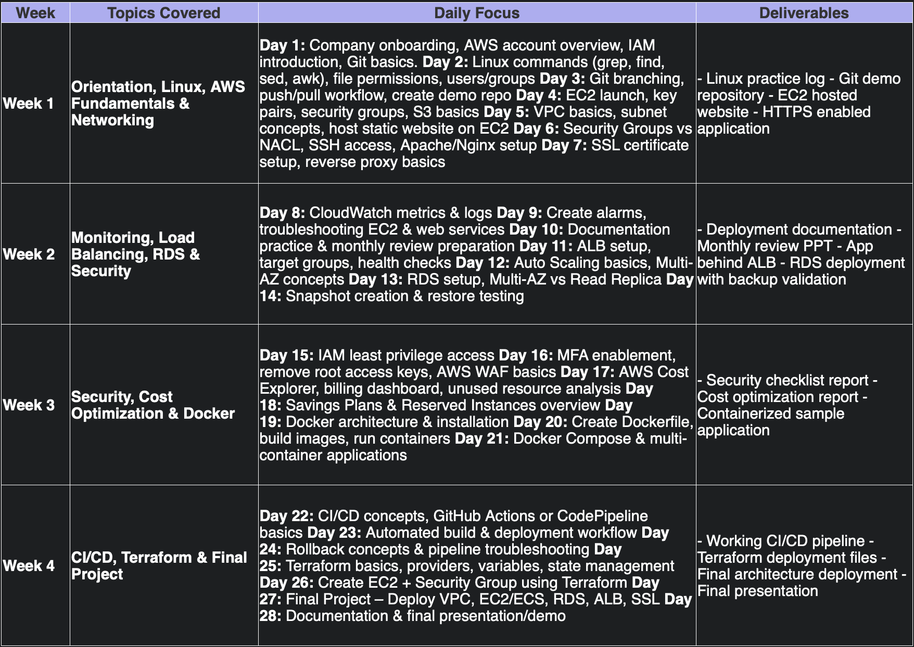

# F9 Internship Notes

*Day 1, Date 10-08-2026:*
Completed tasks:  
    - Overview of company, and structured plan of tasks ahead as produced by Team Lead.
    - Repo created to log daily tasks and agendas.
    - Went through IAM Basics and created a demo IAM user.
    - Went through GIT basics, installed git on system.
    - Installed IDE (Antigravity), getting familiar with git commands.

Tools covered: Github, IAM, AWS root account, Git.

*Day 2, Date 11-08-2026:*
Completed tasks:
        - EC2 instances launched
        - Created demo directories for practice of Linux commands.
        - Logged all commands in session.logs for final presentation.

Terminologies covered: keypair, ssh,chmod,aws ec2,security groups,
chmod,grep,find,sed,awk.

*Day 3, Date 12-08-2026:*
Completed tasks:
        -Previous day objective of user/group permissions and access controls in the EC2 instance terminal.
        - Got familiar with Github workflows and commands.
        -Created a demo repo to test out the commands and simultaneously recorded and pushed it with the commands performed.

Terminologies covered: whoami,groups,id,[owner,group,others],chown
                        git clone,init,satus,add,commit,log,switch,branch.
Summary: user --> group --> directory ownership --> directory permission --> file ownership --> file permissions

*Day 4, Date 13-08-2026:*
Completed tasks:
        - Todays tasks included creating an EC2 instance, already done so started by creating one another instance to refresh knowledge.
        - Hosted an HTTP server by installing apache2 and enabling the service, modified the index.html file at default directory of apache server ( var/www/html).
        - Used the same Secuiry group and key pair, modified the SG to enable listening on port 80 also (HTTP).
        - Expected outputs received for both websites.
        - Started with basics of S3 - buckets, objects, uploading files, lifecycle rules, permissions, endpoint.
        - Uploading a demo static file including index.html.
        - Accessed and verified the working of the website using the s3 bucket endpoint.
        - Difference of hosting a website in ec2 instance and the s3 bucket.
        - Pushed the locally available demo website used for s3 bucket to GH and cloned it from the ec2 terminal. Moved the cloned files from default directory to the apache display directory /var/www/html to then view the new website on the public address.

Terminologies covered: ec2, keypairs, sg, s3 bucket, obkects, permission, systemctl, apache2, ports.

*Day 5, Date 14-08-2025:*
Completed tasks:
        - Covered VPC basics.
        - Created a custom VPC apart from the given default VPC.
        - During creation, learnt more about the configs of subnets, CIDR blocks, routing table - networking concepts that helps to limit as well as allow traffic from IP address range according to our interests.

*Day 6, Date 15-08-2025:*
Completed tasks:
        - Already done with teh apache setup, to test the working EC2 instance.
        - Shell concepts covered with it.
        - Security group configs to enable port 22 access.
        -NACL differences from the SG understood.(inbound as well as outbond, deny access also.)
        - Experimented with NACL, SG, by enabling and disabling ports for a .py static website with port 5000 open.

*Day 7, Date 16-08-2025:*
Completed tasks:
        - Setup a reverse proxy keeping an nginx server in front of an apache server.
        - Modified the config files of the apache server to recieve traffic from port 8080 and localhost only, to avoid port conflict with aapche port 80.
        - Used nginx server to enable https connection to the website using a demo keypair and certificate (self signed) and also opened port 443 for https connection.
        - Verified everything is working and final apache server is the one serving traffic.
        - 

Terminologies covered: reverse proxy, nginx, apache, https, ports, certificates, self signed, keypair, config files, serving traffic.

*Day 8, Date 17-9-2026:*
Completed tasks:
        -Familiarity with clooudwatch meterics and logs, metrics --> cpu utilisation,network etc, good for alerting, monitoring, overall statisitcs. logs --> check the reason for how metrics work, best use case for troubleshooting to find what went wrong.
        - Watched metrics of the EC2 instance afetr and before cpu spiking (py program to manually spike cpu util.)
        - Created an CW Agent custom namespace, added IAM role with two policies associated with CW Agent. SSM agent configured in order to configure agent use.
        - Create a dashboard and added widgets for metrics.
        - Stress test the instance, watched the dashboard raise up after program running and website refreshed.

*Day 9, Date 18-08-2026:*
Completed tasks:
        -Implemeted an alarm log, that autoamtically sents a mail with body as given after a threshold has passed. Used CPUutilisation metric for the alert.
        - Received alert, stopped the instance automatically as set in alert rule, found out the error.
        - Played around with apche2 servers and the website around it. Deliberately broke the site by changing access permissions of the index.html file (chmod) --> Error message "access denied". Checked unresponsiveness of temrinal when security inbound rules for http port 80 is altered --> Connection timed out. Config files are
        - Common troubleshooting implementation using terminal and log monitoring studied.

*Day 10, Date 19-08-2025:*
Completed tasks:
        - Created a presentation, combining all progresses journalled.
        - Refreshed concepts covered upto now.

*Day 11, Date 20-08-2025:*
Completed tasks:
        - Got familiar with ALB concepts- listener, target groups, health checks, routing algo.
        - Implemented an ALB sitting in front of three apache web servers with the listener porting to htttp port 80 and roles to forward the traffic to the target groups, each group hosting a different website.
        - Understood the ALB workflow of Listener --> Target Groups --> Targeted EC2 instances.
        - Accessed the website fromt eh newly provided ALB domain url.
        - Monitored the metrics in cloudwatch for the ALB and the target groups. Altered the traffic flow for health checks.
        - After refreshing the website, each site loaded alternatively, hence learning Round-Robin algo.
        - Stopped one apache2 service of one instance and found flagging of unhealthy status of that instance.
        - Turning on stikcy sessions, keep one isntance connected to user for multiple refreshes.
        

*Day 12, Date 21-08-2025:*
Completed tasks:
        - Learned AMI (golden images) as reusable blueprints capturing 
        OS + software configuration
        - Built Launch Template defining instance recipe: AMI, instance type, 
        key pair, security group
        - Created Auto Scaling Group with desired=2, min=1, max=3 spread 
        across 2 AZs
        - Enabled ELB health checks so ASG responds to app-level failures, 
        not just instance crashes
        - Watched ASG auto-launch 2 identical instances (no manual clicks)
        - Triggered self-healing: stopped Apache on one instance → ASG 
        detected unhealthy status, terminated it, launched replacement 
        within 2–3 minutes
        - Tested CPU-based scaling policy (50% threshold) → stress test 
        triggered auto-launch of 3rd instance, scaled back down post-load
        - Key concept: ASG assumes identical clones (replacement is automatic, 
        not manual intervention)
        

